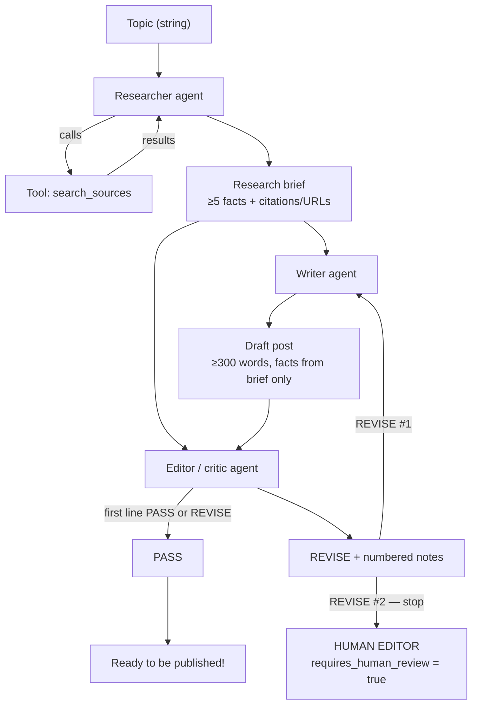

# Content Production Agent

## Project context

Fieldstone Media already produces good travel posts. The bottleneck is **time** (~3 billable days: a researcher gathers sources, a writer drafts, an editor fact-checks line by line). Quality is not the problem; throughput is.

This prototype keeps those three roles as separate agents, keeps the editor’s veto, and keeps a **person** before anything would publish.

**Architecture for this project lives in this README** (see [Architecture](#architecture) below).

## Team

| Name | Role | Owns |
|---|---|---|
| **Darnel Castor** | Logging & Observability Engineer | Full exchange logs (`observability.py`, `logs/`) |
| **Kellie Quinn** | Prompt Engineer | System prompts (`prompts.py`) |
| **Mackayla Rodriguez** | Integration Engineer | Tools, data sources, agent handoffs (`tools.py`, `pipeline.py`, `llm.py`) |
| **Jared Turner** | Orchestrator Engineer | Manager / routing (`orchestrator/`, `main.py`) |

Critic rules and the two-REVISE human-editor gate are in `critic.py`.

## Architecture



### What each agent does

| Agent | System prompt | Temperature | Tools | Job |
|---|---|---|---|---|
| **Researcher** | `RESEARCHER_SYSTEM_PROMPT` | 0 | `search_sources` | Gather sources; output a cited brief. No opinions. |
| **Writer** | `WRITER_SYSTEM_PROMPT` | 0.9 | none | Draft from the brief only. Does not search. |
| **Editor** | `EDITOR_SYSTEM_PROMPT` + critic checklist | 0.2 | none | Fact-check draft **against the brief**. First line **PASS** or **REVISE**. |

No agent does another agent’s job: the writer never searches; the editor never rewrites the whole post; the researcher never drafts the blog.

### Handoff data (shared state)

| Step | Input | Output |
|---|---|---|
| 1 | `topic: str` | `research_brief: str` |
| 2 | topic + research brief | `draft: str` |
| 3 | topic + research brief + draft | `editor_verdict: str`, `decision: PASS \| REVISE \| UNKNOWN` |
| Retry | brief + previous draft + editor notes | new `draft` |
| Stop | two `REVISE` decisions | `requires_human_review: true` |

Workflow state also stores `retry_count`, `revise_count`, `run_id`, `timings`, and `traces` (message lists for logging).

### Approval gate (human checkpoint)

The system **does not publish**. After **two REVISE** verdicts it **stops and flags a human editor** (`FLAGGED FOR HUMAN EDITOR`). One rewrite is allowed between those two reviews. If the editor’s text is not clearly PASS or REVISE (`UNKNOWN`), that also flags a human. A too-short draft (<300 words) can override a generous PASS (critic and editor disagree → critic wins).

## How to run

Python **3.10+** (3.12 recommended). DeepSeek key from class.

```bash
cd Content-Production-Agent
python3 -m venv .venv
source .venv/bin/activate          # Windows: .venv\Scripts\activate
pip install -r requirements.txt
cp .env.example .env               # paste DEEPSEEK_API_KEY
```

**Graded path (no extra typing):**

```bash
python pipeline.py "best time to visit Lisbon"
```

Optional:

```bash
python pipeline.py "hiking in Patagonia" --trace   # compact terminal exchange
python main.py                                     # orchestrator; prompts for a topic
```

`--trace` prints a readable per-agent exchange. **Every run** also appends JSONL logs under `logs/` (gitignored).

If live search fails, `search_sources` falls back to a stub catalog so the pipeline still finishes instead of crashing.

## Logging

Darnel’s `observability.py` records **inputs, outputs, tool calls, and decisions**:

| Output | What |
|---|---|
| Terminal timeline | Clock + duration + tools + critic decision |
| `logs/observability_log.jsonl` | Full message exchange per agent invoke |
| `logs/pipeline_metrics.jsonl` | Duration, message count, tool-call count |
| `--trace` | Compact exchange (handoff size, tool calls, verdict preview) |

Each line is tagged with a `run_id`. See `OBSERVABILITY.md`.

## Repository layout

```
Content-Production-Agent/
  agents/           Researcher, writer, editor builders
  orchestrator/     Manager + workflow state
  logs/             Runtime JSONL logs (gitignored contents)
  critic.py         PASS / REVISE rules, 2× REVISE → human
  tools.py          search_sources (live web search)
  pipeline.py       Handoffs + retry loop
  prompts.py        System prompts
  llm.py            Shared DeepSeek model
  observability.py  Logging
  main.py           Orchestrator entry point
  requirements.txt
  .env.example
```
